The Plymouth Humanoid

Proj 500 Meng Group Project 25/26

Brendan Taylor

Charles Warhurst

Joseph Andrews

Aisling Cleary

# 1 Abstract

The Plymouth Humanoid project concerned the development of a humanoid bipedal robotic platform intended to support stable standing and bipedal locomotion through a reinforcement-learning-based control approach. The project addressed the integration of mechanical design, embedded electronics, real-time control, simulation and high-level computation within a single modular research platform.

A structured simulation pipeline was developed to support reinforcement learning policy generation and validation prior to hardware deployment. A CAD-derived robot model was converted into a URDF representation and subsequently into a USD articulation compatible with NVIDIA Isaac Sim, forming a physics-based digital twin of the platform. This environment enabled systematic validation of kinematic behaviour, joint constraints and actuator configuration before introducing learning-based control. Reinforcement learning environments were then constructed within Isaac Lab, incorporating observation models, control interfaces and noise characteristics consistent with the intended hardware deployment. This approach ensured that policies were trained within a framework that closely reflected real-world constraints, enabling a direct pathway from simulation to executable control policies.

The physical platform comprised an aluminium skeletal structure developed in collaboration with Robotricks, together with supporting electronics allowing for efficient power delivery, effective embedded control and onboard real-time computation systems. System coordination was managed through ROS 2 Jazzy, linking an NVIDIA Jetson Thor development board, for high-level policy execution, with a custom STM32-based real-time control unit and actuator communication over a CAN bus network.

Overall, the project established the core architecture required for a humanoid bipedal research platform and provided a foundation for the implementation and evaluation of reinforcement-learning-based locomotion within a physical robotic system.

# 2 Contents

[1 Abstract [1](#abstract)](#abstract)

[2 Contents [2](#contents)](#contents)

[3 Introduction [3](#introduction)](#introduction)

[3.1 Project Overview [4](#project-overview)](#project-overview)

[3.2 Project Objectives [5](#project-objectives)](#project-objectives)

[3.3 Project scope and limitations [5](#project-scope-and-limitations)](#project-scope-and-limitations)

[4 Project Definition [6](#project-definition)](#project-definition)

[4.1 Detailed system and subsystem analysis [7](#detailed-system-and-subsystem-analysis)](#detailed-system-and-subsystem-analysis)

[4.1.1 Mechanical Subsystem [7](#mechanical-subsystem)](#mechanical-subsystem)

[4.1.1.1 Skeletal Structure [7](#skeletal-structure)](#skeletal-structure)

[4.1.1.2 Joint and Actuator Mounting [8](#joint-and-actuator-mounting)](#joint-and-actuator-mounting)

[4.1.1.3 Protective Shrouding [9](#protective-shrouding)](#protective-shrouding)

[4.1.2 Electrical Subsystem [9](#electrical-subsystem)](#electrical-subsystem)

[4.1.2.1 Power Management Systems [9](#power-management-systems)](#power-management-systems)

[4.1.2.2 Real-Time Control Systems [9](#real-time-control-systems)](#real-time-control-systems)

[4.1.2.3 Regenerative Energy Handling [9](#regenerative-energy-handling)](#regenerative-energy-handling)

[4.1.3 Simulation Subsystem [9](#simulation-subsystem)](#simulation-subsystem)

[4.1.3.1 Robot Model Generation [10](#robot-model-generation)](#robot-model-generation)

[4.1.3.2 Locomotion Policy Development [10](#locomotion-policy-development)](#locomotion-policy-development)

[4.1.3.3 Sim-To-Real Deployment [11](#sim-to-real-deployment)](#sim-to-real-deployment)

[4.1.4 Software Subsystem [11](#software-subsystem)](#software-subsystem)

[4.1.4.1 High-Level Control and Policy Execution [12](#high-level-control-and-policy-execution)](#high-level-control-and-policy-execution)

[4.1.4.2 System Communication and Data Transfer [12](#system-communication-and-data-transfer)](#system-communication-and-data-transfer)

[4.1.4.3 Hardware Interface and Motor Coordination [12](#hardware-interface-and-motor-coordination)](#hardware-interface-and-motor-coordination)

[4.2 System architecture overview [12](#system-architecture-overview)](#system-architecture-overview)

[5 Project Management [14](#project-management)](#project-management)

[5.1 Team Roles and Responsibilities [14](#team-roles-and-responsibilities)](#team-roles-and-responsibilities)

[5.2 Work Breakdown Structure [14](#work-breakdown-structure)](#work-breakdown-structure)

[5.3 Gantt Chart [15](#gantt-chart)](#gantt-chart)

[5.4 Risk Management [15](#risk-management)](#risk-management)

[5.5 Communication and Version Control [15](#communication-and-version-control)](#communication-and-version-control)

[5.6 Ethical, Safety and Legal considerations [16](#ethical-safety-and-legal-considerations)](#ethical-safety-and-legal-considerations)

[6 -- Project Research [16](#background-and-research)](#background-and-research)

[6.1 -- General Humanoid Robotic Background Research [17](#general-humanoid-robotic-background-research)](#general-humanoid-robotic-background-research)

[6.2 -- Mechanical research [17](#mechanical-research)](#mechanical-research)

[6.3 -- Electrical Research [18](#electrical-research)](#electrical-research)

[6.4 -- Simulation and RL Research [18](#simulation-and-rl-research)](#simulation-and-rl-research)

[6.5 -- Software Stack and Control Research [19](#software-stack-and-control-research)](#software-stack-and-control-research)

[7 Mechanical Design [19](#mechanical-design)](#mechanical-design)

[7.1 Mechanical Overview [20](#mechanical-overview)](#mechanical-overview)

[7.2 Initial Skeletal Design [21](#initial-skeletal-design)](#initial-skeletal-design)

[7.3 Shrouding Design [21](#shrouding-design)](#shrouding-design)

[7.4 Wooden Prototype [22](#wooden-prototype)](#wooden-prototype)

[7.5 Final Skeletal Design [23](#final-skeletal-design)](#final-skeletal-design)

[7.6 Aluminium Skeletal Construction and Shrouding Mounting [23](#aluminium-skeletal-construction-and-shrouding-mounting)](#aluminium-skeletal-construction-and-shrouding-mounting)

[7.7 Hardware Mounting and Miscellaneous [24](#hardware-mounting-and-miscellaneous)](#hardware-mounting-and-miscellaneous)

[8 Electrical Design [25](#electrical-design)](#electrical-design)

[8.1 Electrical Overview [26](#electrical-overview)](#electrical-overview)

[8.2 PDU [26](#pdu)](#pdu)

[8.3 PSU [26](#psu)](#psu)

[8.4 RCU [26](#rcu)](#rcu)

[8.5 Wiring Harness [26](#wiring-harness)](#wiring-harness)

[8.6 Hardware Integration [26](#hardware-integration)](#hardware-integration)

[9 Reinforcement Learning Environment Design [26](#reinforcement-learning-environment-design)](#reinforcement-learning-environment-design)

[9.1 RL Overview [27](#rl-overview)](#rl-overview)

[9.2 CAD Digital Virtual Twin [27](#cad-digital-virtual-twin)](#cad-digital-virtual-twin)

[9.3 URDF Export and USD Generation [29](#urdf-export-and-usd-generation)](#urdf-export-and-usd-generation)

[9.5 Standing RL [30](#standing-rl)](#standing-rl)

[9.6 Walking Rl [32](#walking-rl)](#walking-rl)

[9.7 Sim to Real Transfer [33](#sim-to-real-transfer)](#sim-to-real-transfer)

[10 Software Stack [35](#software-stack)](#software-stack)

[10.1 Software Overview [36](#software-overview)](#software-overview)

[10.2 ROS initial implementation [36](#ros-initial-implementation)](#ros-initial-implementation)

[10.3 Initial Motor Command Interaction [36](#initial-motor-command-interaction)](#initial-motor-command-interaction)

[10.3.1 Can Bridge [36](#can-bridge)](#can-bridge)

[10.4 Scale up to multiple motors [36](#scale-up-to-multiple-motors)](#scale-up-to-multiple-motors)

[10.5 System Integration [36](#system-integration)](#system-integration)

[11 System Integration and Testing [36](#system-integration-and-testing)](#system-integration-and-testing)

[11.1 Initial Motor Testing [37](#initial-motor-testing)](#initial-motor-testing)

[11.2 Breaking Chopper Testing [38](#breaking-chopper-testing)](#breaking-chopper-testing)

[11.3 Power on Testing [38](#power-on-testing)](#power-on-testing)

[11.4 Simulation System Integration and Testing [38](#simulation-system-integration-and-testing)](#simulation-system-integration-and-testing)

[11.5 Reinforcement Learning System Testing [39](#reinforcement-learning-system-testing)](#reinforcement-learning-system-testing)

[11.6 Sim-to-Real Integration Testing [40](#sim-to-real-integration-testing)](#sim-to-real-integration-testing)

[11.7 Walking Accuracy Testing [40](#walking-accuracy-testing)](#walking-accuracy-testing)

[12 Results and Critical Evaluation [40](#results-and-critical-evaluation)](#results-and-critical-evaluation)

[12.1 System Performance evaluation [41](#system-performance-evaluation)](#system-performance-evaluation)

[12.2 Comparison to Specification [41](#comparison-to-specification)](#comparison-to-specification)

[13 Conclusion and Future Improvements [41](#conclusion-and-future-improvements)](#conclusion-and-future-improvements)

[13.1 Conclusion [42](#conclusion)](#conclusion)

[13.2 Future Improvements [42](#future-improvements)](#future-improvements)

[14 Figures [42](#figures)](#figures)

[15 Appendices [43](#appendices)](#appendices)

[16 References [45](#references)](#references)

[References [46](#_Toc1190841793)](#_Toc1190841793)

# 3 Introduction

## 3.1 Project Overview

The Plymouth Humanoid project was undertaken to develop a bipedal humanoid robotic platform capable of stable standing and bipedal locomotion. The project addressed one of the most demanding robotics problems requiring the integration of mechanical design, embedded electronics, real-time system control, simulation and high-level software into a single functional system. Rather than treating locomotion as an isolated control problem, the project approached it as a full system engineering challenge in which physical design, actuator control, power delivery and software architecture all had to operate together reliably.

The development of a stable bipedal platform presented multiple significant technical challenges across a spectrum of areas within robotics. A mechanically robust aluminium structure was required to support the actuator arrangement, withstand repeated testing and be stable for repeated instances of walking, while custom electrical systems were needed to provide dependable power distribution and real-time control capability to the system. In parallel, a reinforcement-learning-based development environment was required to generate and refine locomotion behaviour before deployment on the physical platform. This demanded the creation of a reliable software stack capable of linking simulation, policy execution and low-level actuator interfacing.

To enable efficient development of control policies within the available project timeframe, a structured simulation pipeline was implemented using NVIDIA Isaac Sim and Isaac Lab. The robot was first modelled in CAD and converted into a URDF representation, which was then processed into a USD articulation to create a physics-consistent digital twin within the simulation environment. This allowed validation of joint behaviour, coordinate alignment and actuator configuration prior to introducing reinforcement learning. Custom environments were developed to support standing and locomotion tasks, with observation models and control interfaces designed to reflect the constraints of the physical system. By embedding these considerations directly into the simulation, the approach ensured that learned policies were compatible with the intended deployment architecture, enabling a direct transition from simulation to execution on the Jetson Thor platform.

This report presents the development of the Plymouth Humanoid across the major engineering areas required for its realisation. It covers the overall system definition, project management approach, mechanical and electrical development, reinforcement learning environment, software architecture, system integration and testing. In doing so, it documents both the design philosophy adopted throughout the project and the practical challenges, corrections and engineering decisions encountered during development.

## 3.2 Project Objectives

The main aim of the project was to develop a humanoid robotic platform capable of bipedal locomotion. To support this overall aim. A series of specific technical objectives were defined to guide the development of the mechanical, electrical, simulation and software subsystems within the project being:

Objective 1 - Design and manufacture a mechanically robust humanoid skeletal frame suitable for a diverse movement range and later system expansion.

Objective 2- Develop and integrate supporting electronics including robust power delivery system capable of high current operations (due to the actuators).

Objective 3 - Development and integration of supporting electronics subsystems allowing for real-time control and computation of actuator movement.

Objective 4 -- Develop a simulation-ready digital twin and integrate it into NVIDIA Isaac Sim/Isaac Lab, including validation of joint kinematics, coordinate alignment and actuator configuration.

Objective 5 -- Establish a reinforcement learning framework for standing and walking tasks, including appropriate observation models, action spaces and reward design.

Objective 6 -- Establish a software and control framework capable of linking high-level policy execution from the Nvidia Jetson Thor platform with low-level real-time motor control.

Objective 7 -- Demonstrate stable walking behaviour within the simulation framework and validate compatibility with the sim-to-real pipeline.

Objective 8 -- Evaluate the effectiveness and limitations of the adopted sim-to-real development workflow for the humanoid within the project timescale.

This objective provided a structured framework for the project and aligned with the major subsystem development areas. The also established clear milestones against which progress, integration and final technical achievements could later be assessed upon.

## 3.3 Project scope and limitations 

Given the scale and multidisciplinary nature of the Plymouth Humanoid project, a clearly defined scope was required in order to maintain technical focus and reduce the risk of scope creep within the project. Therefore, the platform was scoped around the design, specification, and integration of a bipedal humanoid robotic platform, with emphasis placed on three core areas: a mechanically robust skeletal structure, expandable supporting electronics, and a reinforcement-learning-based software and control framework capable of supporting locomotion development with heavy emphasis on future expandability.

The primary focus of the project was the achievement of core bipedal locomotion functionality through a sim-to-real development approach. As a result, the scope was limited to the lower-body platform and the subsystems required to support standing and walking behaviour as well as housing the necessary electronics. Full upper-body functionality, including arm actuation and manipulation tasks, was excluded from the final design in order to maintain focus on the core locomotion challenge. Similarly, the project did not seek to deliver a fully mature autonomous humanoid system with perception-led navigation or advanced environmental awareness.

The project was also constrained by the available development timescale. For this reason, the intended outcome was not a fully optimised or a perfect highly robust walking system across diverse environments, but rather the establishment of an integrated platform capable of supporting stable standing, early-stage walking validation and assessment of the overall sim-to-real workflow. In addition, sensing and feedback were limited to the core signals required for locomotion development, such as inertial and actuator feedback, rather than the broader sensing suites used in more advanced humanoid systems, such as machine vision or environment-mapping sensors.

These limitations were considered appropriate to the academic aims of the project. Rather than attempting to solve all aspects of humanoid autonomy, the work focused on establishing the core mechanical, electrical, simulation, and control architecture necessary to support future development as a university led project.

# 4 Project Definition

## 4.1 Detailed system and subsystem analysis

The project was divided into four principal development subsystems: mechanical development, electrical and electronics development, reinforcement-learning simulation development, and software and control development. Each of these principal areas was further decomposed into key constituent subsystems in order to support a clearer overall system architecture and a more structured development process. The relationship between the main subsystems and their constituent elements is illustrated in Fig. 1.

  ------------------------------------------------------------------------------
  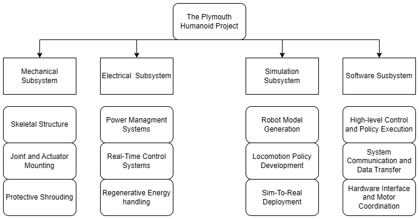{width="6.104166666666667in" height="3.1875in"}
  ------------------------------------------------------------------------------
  Figure 1 -- Humanoid project subsystems and key aspects

  ------------------------------------------------------------------------------

### 4.1.1 Mechanical Subsystem

#### 4.1.1.1 Skeletal Structure

The skeletal structure formed the primary load-bearing framework of the Plymouth Humanoid and acted as the mechanical foundation upon which all major subsystems where integrated upon. Its purpose was to provide sufficient structural rigidity to support the actuator-driven leg assemblies during standing and walking locomotion, while maintaining a suitable freedom of movement within the 6 DOF leg assembly such that the leg can achieve required positions. As the core mechanical element of the platform, the skeletal structure was required to balance strength, manufacturability, modularity and overall mass within a unified framework.

The initial structural concept, provided by Robotriks, was based on a bilateral leg arrangement with 6 DOF per leg. This concept remained throughout the course of the project and the initial structural concept remained at the core throughout the mechanical design and fabrication phases to remain close to the initial concept. However, changes to allow for a wider range of mounting options, user configurability and easier manufacturing processing were implemented as part of the mechanical design process. The resulting structure retains the desired humanoid frame while moving towards a more practical construction approach.

Aluminium was selected as the primary structural material due to its favourable combination of strength, relatively low mass, cost-effectiveness and ease of machining, once again thanks to the Robotriks collaboration. This made it well suited to a robotic prototype expected to undergo repeated assembly, adjustment and consequential development and testing. The use of aluminium also provided a more robust and dimensionally stable solution than a polymer-based structure, particularly in areas subject to high joint loading and actuator reaction forces such as the knee joint and hip joint areas.

From a design perspective, the skeletal structure had to satisfy several competing requirements. Namely, the structure needed to be sufficiently stiff to avoid unnecessary actuator demand. In addition, the structure had to allow for practical mounting of the actuators, with considerations for caballing, resulting the shrouding elements being a vital requirement. The finial configuration was therefore not only a structural frame, but also an integration platform that enabled the interactions of the mechanical, electrical and control subsystems withing the frame.

Overall, the skeletal structure represented the single critical element of the Plymouth Humanoid project, as a unified platform providing the necessary strength and integration capability of the wider system.

#### 4.1.1.2 Joint and Actuator Mounting

The joint and actuator mounting arrangement formed a critical part of the mechanical subsystem, as it provided the physical interface between the structural frame and the chosen RobStride 04 actuators used to drive the leg joints. This arrangement was required to maintain accurate actuator alignment across both limbs, transfer joint loads effectively into the surrounding structure and preserve the intended range of motion required for effective bipedal locomotion. In addition, the mounting design had to support practical assembly while maintaining sufficient accessibility for maintenance and the repeated installation of actuators throughout the prototyping stage of the project.

The initial joint architecture, provided by Robotriks, established the baseline desired bipedal configuration. Following a wooden prototype dry run and subsequent initial aluminium construction, the joint and actuator positions were validated as being correctly placed to allow an impressive range of motion, limited only by plate geometry considerations and compression when folded into a compact package. As a result, the initial joint and actuator positions were validated and carried forward into the final design with relatively little further alteration.

From a system perspective, the quality of the actuator mounting remained critical throughout not only the design stage, but also the construction phase of the project. Therefore, correctly sized bolts mirrored across both sides were utilised to minimise potential differences and reduce areas of possible issue during the physical actuator mounting process.

#### 4.1.1.3 Protective Shrouding

The protective shrouding formed a secondary but important element of the mechanical subsystem, providing non-load-bearing external coverage around important areas of the humanoid structure. The primary purpose of the shrouding was to conceal and protect internal cabling, reducing the likelihood of wiring being snagged and subsequently damaged during assembly and operation. In addition, the shrouding was designed to reduce exposed pinch points and overall sharp and hazards edges particularly around moving joints and structural interfaces, helping to improve the overall safety of the platform during handling, testing and maintenance. This was particularly important within a prototype system containing multiple high-torque and potentially dangerous actuator-driven joints, where repeated movement and close mechanical clearances increased the risk of accidental contact with moving components.

Although safety and cable protection formed the main functional drivers, the shrouding also contributed to the overall presentation of the robot by giving the platform a more complete and integrated appearance. The components were produced using 3D printing, allowing custom geometries to be developed rapidly and adapted alongside the evolving mechanical structure without significantly increasing manufacturing complexity. From a wider system perspective, the shrouding improved the practicality and usability of the platform by supporting safer operation, cleaner subsystem integration through custom applications and more effective protection of vulnerable wiring routes. While it did not contribute directly to the robot's load-bearing capability, it played an important supporting role in improving the robustness, maintainability and professionalism of the final mechanical package

### 4.1.2 Electrical Subsystem

#### 4.1.2.1 Power Management Systems

#### 4.1.2.2 Real-Time Control Systems

#### 4.1.2.3 Regenerative Energy Handling

### 4.1.3 Simulation Subsystem

The simulation subsystem was developed to support the generation, validation and deployment of reinforcement-learning-based control policies for the Plymouth Humanoid. It formed a critical bridge between the mechanical design and the control architecture, enabling the behaviour of the robot to be developed in a physics-based environment prior to hardware execution.

Rather than relying on direct hardware experimentation, the subsystem provided a structured pipeline through which the robot model could be validated, control policies trained, and deployment interfaces defined. This reduced the risk of hardware damage during early-stage development and allowed controlled iteration of control strategies.

The simulation subsystem was composed of three primary elements: robot model generation, locomotion policy development, and sim-to-real deployment. These elements together enabled the transition from a CAD-defined mechanical system to executable control policies compatible with the physical robot.

#### 4.1.3.1 Robot Model Generation 

The robot model generation stage focused on transforming the CAD representation of the humanoid into a simulation-compatible format. This involved converting the mechanical design into a structured kinematic model and ensuring that it accurately represented the physical system.

The CAD model was exported into a URDF representation and converted into a USD articulation suitable for use within NVIDIA Isaac Sim. Additional steps were required to ensure numerical consistency, correct coordinate alignment, and valid articulation structure.

Validation of the generated model was carried out prior to its use in reinforcement learning, including verification of joint axis orientation, joint limits and overall articulation behaviour. This ensured that the model provided a reliable foundation for subsequent simulation and control development.

#### 4.1.3.2 Locomotion Policy Development

The locomotion policy development stage focused on generating control strategies for the humanoid using reinforcement learning within a physics-based simulation environment.

Reinforcement learning environments were defined to represent the robot's state and control interface in a manner consistent with the physical system. This enabled the generation of control policies through interaction with the simulated environment.

The development process was staged, beginning with a standing task to establish balance before progressing to locomotion tasks of increased complexity. This approach supported incremental development of control behaviour, ensuring that stability was achieved prior to introducing dynamic motion.

#### 4.1.3.3 Sim-To-Real Deployment

The sim-to-real deployment stage focused on enabling trained policies to be transferred from the simulation environment to the physical robot through a consistent control interface.

A shared control structure was defined to ensure compatibility between simulation outputs and hardware inputs, including joint ordering, control scaling and observation structure.

An abstraction layer was used to standardise the interaction between the policy and the data source, allowing the same control logic to operate with both simulated and real sensor inputs.

Trained policies were exported into a deployment-compatible format, enabling execution within a real-time control loop on the target hardware platform and establishing a direct link between simulation and physical execution.

### 4.1.4 Software Subsystem

#### 4.1.4.1 High-Level Control and Policy Execution

#### 4.1.4.2 System Communication and Data Transfer

#### 4.1.4.3 Hardware Interface and Motor Coordination

#### 

## 4.2 System architecture overview 

  -----------------------------------------------------------------------------------------
  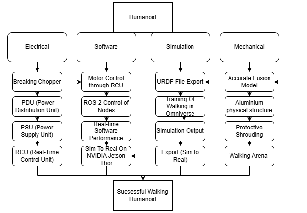{width="6.104166666666667in" height="4.229166666666667in"}
  -----------------------------------------------------------------------------------------
  Figure 2 -- System key component architecture

  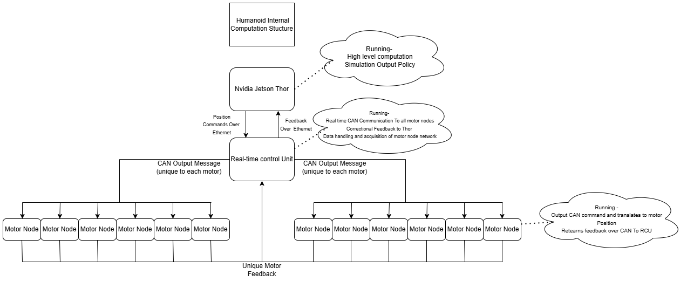{width="6.104166666666667in" height="2.5in"}

  Figure 3 -- System Computational Diagram
  -----------------------------------------------------------------------------------------

Figure 2 represents a high level system architecture overview showing the interconnected nature of the internal subsystems. The 4 major areas of the project while separated in workflow are reliant upon each other for the successful outcome of a walking humanoid robot. The electrical subsystem provided power delivery, regenerative handling, and real-time control hardware; the software subsystem managed motor control and ROS 2-based coordination; the simulation subsystem supported model generation, policy training, and sim-to-real export; and the mechanical subsystem provided the physical platform on which these functions were implemented safely. This overview was what was later carried forward into the planning stages of the project to device workflow and for general understanding of the necessary key components of the project.

Figure 3 shows a slightly more in-depth look at an overview of the computational system within the humanoid as the successful communication between all node within the system is key to real-time performance. High-level locomotion policy execution was carried out on the NVIDIA Jetson Thor platform, which interfaced with the real-time control unit, responsible for actuator-level command distribution, through an ethernet connection. The real-time control unit transmitted output messages to the distributed motor nodes via the CAN network, while unique motor feedback was returned from each actuator to support state monitoring and closed-loop operation. This separation between high-level policy computation and low-level deterministic control formed a key architectural feature of the system, allowing reinforcement-learning-based outputs to be integrated with practical hardware control requirements without speed limitations or bottlenecks from the Nvidia Thor\'s outputs.

# 5 Project Management 

## 5.1 Team Roles and Responsibilities

The team was organised according to both individual interest and the major technical subsections of the project. Responsibility was distributed across the four principal development areas, with testing retained as an additional responsibility on completion of the successful system. Brendan acted as overall project and team lead, while also leading the mechanical and testing activities. Charlie was responsible for the electrical subsystem, Joe for the simulation subsystem, and Aisling for the software subsystem.

These roles were assigned through internal team agreement and were chosen to align each member with an area of personal interest and technical focus. Establishing clear subsystem leads ensured that each major area of the project had a member with direct oversight and continuity of understanding throughout development. Nevertheless, the project was not approached as four isolated work packages. Although each area had a nominated lead, all team members were expected to contribute across different subsections where appropriate in order to support integration, shared decision-making and overall project progress.

## 5.2 Work Breakdown Structure 

Figure 4 illustrates the initial Work Breakdown Structure (WBS) used throughout the Plymouth Humanoid project. The four principal development areas were each assigned a designated team lead, with this responsibility intended to provide clear ownership of progression and continuity within each area rather than to indicate isolated or individual work. Although each major section had a nominated lead, all group members were expected to contribute across other aspects of the project where appropriate in order to support integration and overall progress.

The WBS shown in Figure. 4 highlights the main elements of the system considered during the initial planning and development stages. As the project progressed, further adjustments, additional tasks, and changes in workload were recorded through supporting management tools, including a Kanban board, Microsoft Teams channels communication and individual logbooks. This allowed the initial WBS to act as a structured starting point, while day-to-day project development remained flexible enough to reflect the evolving requirements of the humanoid platform.

  -----------------------------------------------------------------------------------------
  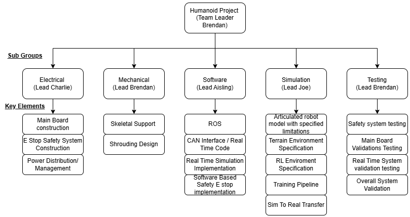{width="6.268055555555556in" height="3.323611111111111in"}
  -----------------------------------------------------------------------------------------
  Figure 4 -- Work Breakdown Structure

  -----------------------------------------------------------------------------------------

## 5.3 Gantt Chart

A link to the full Gantt chart used to support the system development timeline is provided in Appendix X. This was maintained as an active project management document throughout the duration of the project, allowing deadlines and task dependencies to be updated in response to changing project requirements and subsystem progress. As such, the Gantt chart did not function solely as an initial planning tool, but also as a live record of the project schedule and the evolving development process followed during the Plymouth Humanoid.

## 5.4 Risk Management

As part of the preliminary planning process detailed within the project execution plan, a full risk assessment was conducted covering the principal hazards and project risks associated with the Plymouth Humanoid. This included mechanical risks arising from moving joints and pinch points, electrical risks associated with power delivery and actuator current demand, and integration risks linked to software, control, and subsystem interaction. In addition to physical safety hazards, project-level risks such as manufacturing delays, subsystem dependency, and limited integration time were also considered. The risk assessment was used throughout the project as a management tool to identify significant issues, assign appropriate mitigation measures, and support safer development and testing practices. The final risk assessment is included in Appendix X.

## 5.5 Communication and Version Control 

Main project communication was managed through Microsoft Teams, which acted as the central platform for coordination, discussion and file sharing/management between team members. Software version control was maintained through a group GitHub, while CAD version management was handled through Fusion 360's online project hub. Written documentation, including report development and supporting project records, was likewise maintained through Microsoft Teams and the Microsoft 365 Office suite, allowing collaborative access and consistent document control throughout the project.

## 5.6 Ethical, Safety and Legal considerations

Ethical, safety, and legal considerations were addressed throughout the project due to the potential risks associated with developing a large actuator-driven humanoid platform. From a legal and intellectual property perspective, a full patent landscape analysis was completed to identify existing humanoid robotics patents and assess whether any protected approaches could potentially affect the project direction. This report can be found in appendix (NUMBER). From a safety perspective, a full risk assessment was conducted during the planning stage, covering mechanical hazards from moving joints and pinch points, electrical hazards from high-current actuator systems and integration risks associated with software or control failure. Safety measures included the use of multiple emergency stop systems including an arm and disarm switch, controlled power-on procedures and staged testing before full system operation. A dedicated walking frame was also constructed to physically constrain the robot during standing and walking trials, preventing uncontrolled movement outside the test area and allowing the platform to be suspended if required. These measures ensured that the project remained aware of the wider ethical, legal and safety responsibilities involved in developing a powerful experimental robotic system.

##  

# 6 -- Background and Research

## 6.1 -- General Humanoid Robotic Background Research

The Humanoid robotics market has recently seemed a dramatic shift from a largely experimental research area like the traditional Atlas Humanoid toward a more active commercial and engineering development solutions, mainly headway by key Chinese players Unitree. Improvements in actuator design, onboard computation and the use of reinforcement learning-based control have made compact bipedal platforms increasingly feasible, with modern systems now being developed for practical use in human-centred environments. This wider trend helped justify the Plymouth Humanoid as a credible engineering project rather than a purely speculative concept.

One of the most relevant benchmark platforms during this project was the Unitree G1 humanoid, which has become a poster child of recent humanoid robotics development. Unitree presents the G1 as a compact humanoid platform with 23 to 43 joint motors and six degrees of freedom per leg, supported by imitation and reinforcement-learning-based development (Unitree.com, 2016). Its scale, architecture and emphasis on agile locomotion made it a useful point of reference for the direction taken within the Plymouth Humanoid project.

Figure AI also provided an important point of reference, being a major player in the wider humanoid field, particularly through its focus on compact mechanical packaging and advanced lower-body kinematics to become a general-purpose humanoid for everyday tasks (FigureAI, n.d.). This was especially evident in Figure AI's published patent *Hip assembly and kinematics of a humanoid robot* (WO2025213141A1), which describes a hip arrangement intended to improve packaging and motion performance through the positional relationship of the actuators and the use of an angled hip roll axis (Google.com, 2025). The patent further states that this arrangement can increase hip range of motion and improve motions such as deeper squatting, reinforcing the importance of careful hip packaging in modern humanoid development (Google.com, 2025).

During the project, similarly, styled humanoid systems also continued to emerge, including the KAIST Humanoid, which showed a comparable emphasis on compact bipedal locomotion within a research environment (KAIST DRCD Lab, 2026). Taken together, these examples showed that current humanoid robotics is increasingly characterised by compact packaging, high actuator density and AI-supported locomotion development, all of which helped justify the modular and RL locomotion-focused direction of the Plymouth Humanoid.

## 6.2 -- Mechanical research

Initial mechanical research focused on the joint arrangements used in current humanoid robotics, particularly within the lower body where the main locomotion challenge exists. A six-degree-of-freedom leg structure was selected in part because it remains consistent with the current market direction seen in platforms such as the Unitree G1, which also uses six degrees of freedom per leg, and because this level of articulation provides the freedom required for a leg to reach any practical position and orientation needed for bipedal locomotion. Further mechanical research also considered more advanced hip packaging approaches, similar to Figure AI's published patent work or the hip package seen within the KAIST Humanoid on humanoid hip assembly, which has key advantages of actuator layouts and a non-orthogonal hip roll arrangement for improving packaging and range of motion. Although this approach was considered beneficial from a mechanical and kinematic perspective, it was judged to be outside the realistic scope of the present project due to the increased complexity it would have introduced in manufacture, integration and overall system development. As a result, the Plymouth Humanoid adopted a more practical and traditional approach of a hip cluster structure that balanced movement capability with manufacturability within the available project timescale.

## 6.3 -- Electrical Research

## 6.4 -- Simulation and RL Research

The research undertaken for the simulation and reinforcement learning aspects of the project was primarily focused on understanding and applying the NVIDIA Isaac Sim and Isaac Lab development workflow. From the outset of the project, Isaac Sim was selected as the simulation platform, and therefore research activities were directed towards effectively utilising this toolchain rather than evaluating alternative simulation environments.

Rather than being conducted as a single upfront study, research was carried out iteratively throughout the development process as specific technical challenges were encountered. This included investigation into model conversion workflows, articulation configuration, actuator modelling, and reinforcement learning environment design within the Isaac framework. The simulation development plan was structured around key stages, including robot model creation, actuator and sensor representation, environment definition, reinforcement learning configuration, and sim-to-real preparation.

A significant portion of the research effort was dedicated to understanding the correct process for converting CAD-based robot models into simulation-ready assets. This involved researching online robotics development documentation (Open Robotics, 2026), forums and existing humanoid robotics repositories (Project, 2026) to determine best practices for URDF generation, USD conversion, and articulation setup. Particular attention was given to joint structure, coordinate alignment, and ensuring that simulation models reflected the physical robot's kinematic and dynamic properties.

Research into reinforcement learning focused on the practical implementation of environments within Isaac Lab rather than theoretical algorithm development. This included defining observation spaces, action representations, reward structures, and termination conditions in a manner consistent with both the simulation environment and the intended hardware system. Existing humanoid and legged robotics repositories were used as reference points to guide environment design and training strategies. A list of the repos used for research can be found in the appendices\[repos researched\].

Sim-to-real considerations were also investigated as part of the research process. This included reviewing approaches for aligning simulation outputs with hardware interfaces, modelling sensor behaviour, and ensuring consistency in control structure between simulation and deployment. These considerations were integrated into the simulation design from an early stage, rather than treated as a separate post-training process (Nvidia, 2026).

Overall, the research process was highly practical and tool-focused, centred on the application of established workflows and best practices within the Isaac ecosystem. By leveraging official documentation and existing humanoid robotics implementations, the project was able to adopt a structured and informed approach to simulation-based control development, directly supporting the implementation work described in later sections.

## 6.5 -- Software Stack and Control Research

Robotricks manuals and github repos

# 7 Mechanical Design

## 7.1 Mechanical Overview

The initial mechanical concept for the Plymouth Humanoid, provided by Robotriks, was based around a six-degree-of-freedom leg architecture, with each leg designed to provide the full joint motion required for precise and limitation free bipedal locomotion. The system was modelled in Autodesk Fusion 360 and configured around RobStride 04 actuators, forming the core mechanical structure of the platform seen in Figure 5. This initial concept provided the basis for later development, but was subsequently adapted to improve manufacturability, simplify assembly and allow greater scope for future system expansion.

  -----------------------------------------------------------------------------------------
  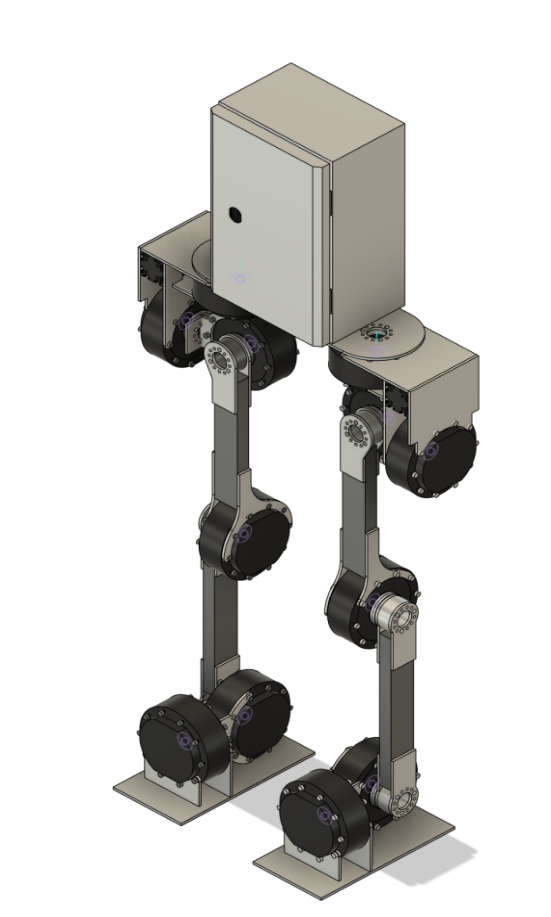{width="2.502083333333333in" height="4.172916666666667in"}
  -----------------------------------------------------------------------------------------
  Figure 5 -- Initial Robotriks skeletal structure

  -----------------------------------------------------------------------------------------

The final mechanical design retained the practical dual six-degree-of-freedom leg arrangement but was refined into a more practical construction using an aluminium structural frame seen in **[Fig. X]{.underline}**. Aluminium was selected due to its favourable balance of strength, low mass, cost and suitability for robotic prototyping applications. The resulting mechanical system consisted of two articulated legs, a simplified flat-foot design to support early-stage standing and walking trials, and an integrated electrical cabinet used to house the major electronic subsystems required for control and power management.

  -----------------------------------------------------------------------------------------
  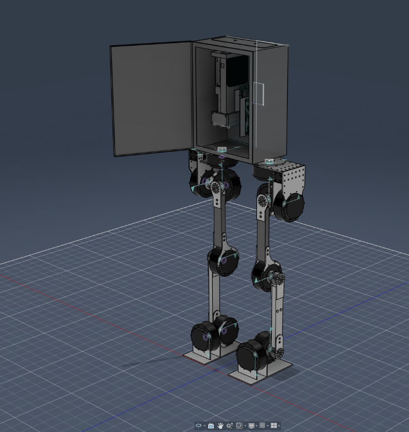{width="3.623824365704287in" height="3.829385389326334in"}
  -----------------------------------------------------------------------------------------
  Figure X -- Final skeletal structure

  -----------------------------------------------------------------------------------------

In addition to the main structural components, custom 3D-printed external shrouding was developed as part of the mechanical package. This served several purposes, including the reduction of exposed pinch points, improved cable routing, protection of internal components and enhancement of the overall appearance of the platform. As such, the mechanical design was not limited to the primary load-bearing structure, but also considered practical issues relating to safety, integration, and maintainability of the hardware for long term viability.

The following subsections present the development of the mechanical system in greater detail, including the progression from the initial concept models and prototype assemblies through to the final frame, shrouding and supporting test structures developed for physical evaluation.

## 7.2 Initial Skeletal Design

The initial skeletal structure, provided by Robtriks and shown in Fig. X above, followed a straightforward bipedal design philosophy, allowing for a full six-degree-of-freedom range of movement per leg. This platform was accompanied by a Schneider Electric cabinet mounted on the upper platform between the two legs, providing a central location for the housing of key electronic subsystems. The initial skeletal structure was then reviewed and adjusted to allow for the mounting of shrouding components where required.

In addition, several structural details were refined to improve manufacturability. Plate joints were changed to a finger-joint configuration in order to simplify sheet metal construction and allow the parts to be more easily welded together for increased strength. Hole sizes and positions were also reviewed and modified to provide suitable M4 and M5 clearance holes, with M4 used for outer-diameter motor connections and the majority of shrouding attachment, and M5 used for inner motor connections. Following these changes, an updated skeletal structure suitable for manufacture was developed in Fusion 360, as shown in Fig. X(final one above).

## 7.3 Shrouding Design

The shrouding design followed an iterative development process throughout the project and remained under continuous refinement across much of the overall project timescale. Shrouding was required for several reasons. Its primary function was to improve cable management within the robot, concealing wiring where appropriate and protecting it from snagging, abrasion or damage caused by repeated joint movement. In addition, the shrouding provided a level of external protection to the robot itself, acting as a sacrificial element in minor impacts so that damage would be more likely to occur to the replaceable shroud rather than the structural components. The shroud also reduced user exposure to sharp corners and potentially hazardous areas, while contributing positively to the overall visual appearance of the platform.

Initial shrouding development began with sketch-based concept work used to identify areas in which exposed cabling and external geometry were likely to present the greatest issues. From this process, the hip, thigh and lower leg (shank) regions were identified as the principal areas requiring coverage and protection. At a later stage, the foot was also recognised as requiring shrouding in order to reduce exposure to sharp structural edges. The resulting initial concepts were then modelled and produced through 3D printing for test fitment on the physical wooden prototype. ABS was initially considered as the print material; however, due to print difficulty and the lack of any significant need for higher-performance material properties at that stage, PLA was later adopted as a more practical and cost-effective solution.

Following first fitment on the wooden prototype, a number of issues relating to part fitment were identified and corrected within the Fusion model. Revised parts were then reprinted and re-tested to accommodate previously unthought or unseen tolerances within the design. This iterative approach was continued across the wider platform, with different shrouding components progressing through multiple generations before reaching their final form. In this respect, the shrouding became one of the most iterative aspects of the mechanical design, with repeated refinement required to ensure compatibility with the surrounding structure, cabling and maintenance access requirements.

One of the most challenging shrouding elements to develop was the outer shank cover, which underwent several major design iterations. The earliest concept was intended to mount directly into the motor region; however, this approach was later abandoned in favour of a cleaner external appearance and improved maintainability through a magnetically attached outer shroud. The magnetically attach option, partly inspired by the quick-access panel approach seen in Unitree robotic developments, offered the potential for easier removal and refitting during maintenance and development was subsequently started on a magnetic lower shank shroud. In practice, however, the magnets used did not provide sufficient retention strength to remain securely attached across the full range of humanoid movement. As a result, this approach was discarded and replaced with a bolted mounting arrangement attached to the leg joint, which provided a more reliable and mechanically secure final solution. A collage of all major iterations of the lower shank shrouding can be seen bellow in Figure X.

  -----------------------------------------------------------------------------------------
  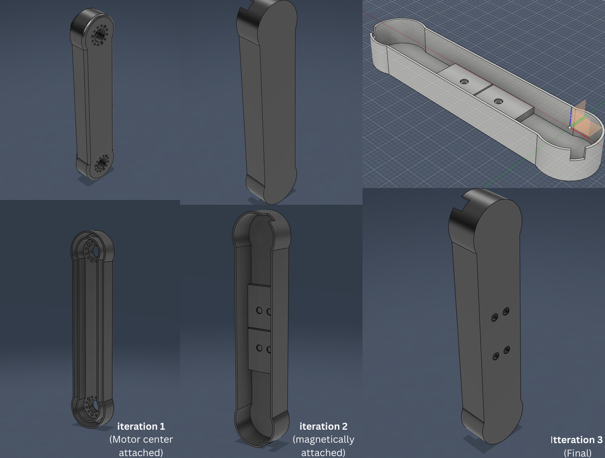{width="6.268055555555556in" height="4.750694444444444in"}
  -----------------------------------------------------------------------------------------
  Figure X -- Lower Shank Shroud iteration collage

  -----------------------------------------------------------------------------------------

Across the wider robot, similar redesign decisions were made in order to improve access to maintainable elements, simplify cable routing and increase the overall usability of the platform. As such, the shrouding was not merely an aesthetic addition, but a significant mechanical integration task in its own right. A complete record of the major shrouding design generations is provided in the appendix under the linked shrouding development file (Appendix X).

## 7.4 Wooden Prototype

To validate fitment and confirm that construction was feasible with the current skeletal arrangement, a full wooden prototype was produced using 3 mm plywood sheets. Figure X bellow documents the cutouts being produced, with Fig. X showing the completed assembly of a single leg together with the attached hip shrouding. This represented an important step prior to committing to aluminium manufacture, as any existing or potential fitment issues could be identified, documented and corrected within the Fusion model before final production. The wooden prototype also supported the development of the shrouding by allowing prototype components to be test-fitted against a full-scale physical representation of the leg intended for aluminium manufacture.

  -----------------------------------------------------------------------------------------------------------------------------------------------------------------------------
  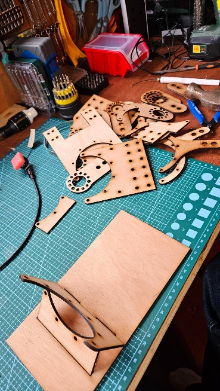{width="1.6770833333333333in" height="2.96875in"}   {width="2.2083333333333335in" height="2.96875in"}
  --------------------------------------------------------------------------------- -------------------------------------------------------------------------------------------
  Figure X -- wooden prototype parts                                                Figure X -- Final wooden prototype assembled

  -----------------------------------------------------------------------------------------------------------------------------------------------------------------------------

## 7.5 Final Skeletal Design

Following the successful construction and evaluation of the wooden prototype, the identified issues were fixed within the Fusion 360 CAD model. The resulting revisions included adjustments to hole positions for improved motor mounting, modifications to hole diameters to resolve clearance issues and the repositioning of selected features to better accommodate the mounting of shrouding components. Figure X below presents the final skeletal model together with the shrouding configuration carried forward into the final system design.

  -------------------------------------------------------------------------------------------
  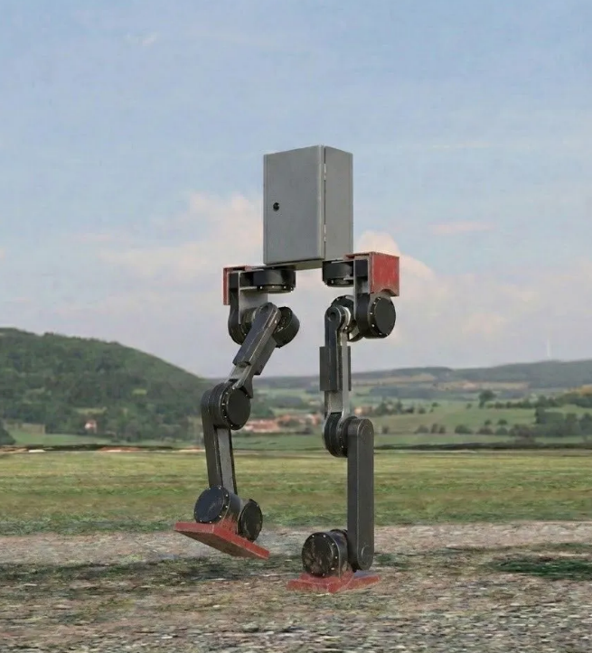{width="2.9795931758530183in" height="3.288908573928259in"}
  -------------------------------------------------------------------------------------------
  Figure X -- Final Skeletal structure render with shrouding attached

  -------------------------------------------------------------------------------------------

## 7.6 Aluminium Skeletal Construction and Shrouding Mounting

After the Fusion model had been finalised, the aluminium parts were manufactured through Robotriks. Produced from 4 mm aluminium sheet, with key areas hand-welded where required. The components where then assembled with care taken to match the final CAD model as closely as possible. A photograph of the assembled legs is shown in Fig. X below.

This assembly was subsequently test-fitted with an enclosure supplied by Robotriks after it was found that the originally selected Schneider Electric cabinet was too small to accommodate the full range of electronics and computing hardware required for the project. Figure X below shows the initial leg structure together with the demonstration enclosure used during this stage of integration.

  -----------------------------------------------------------------------------------------------------------------------------------------------------------------------------
  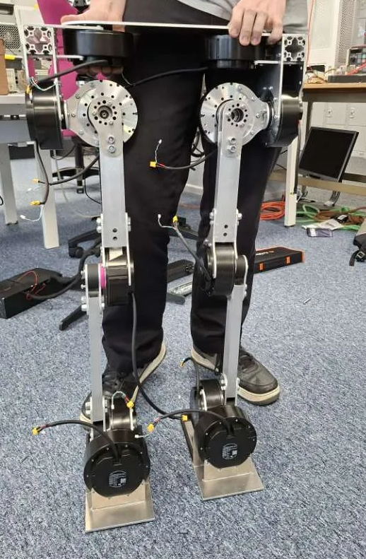{width="2.4618055555555554in" height="3.759027777777778in"}   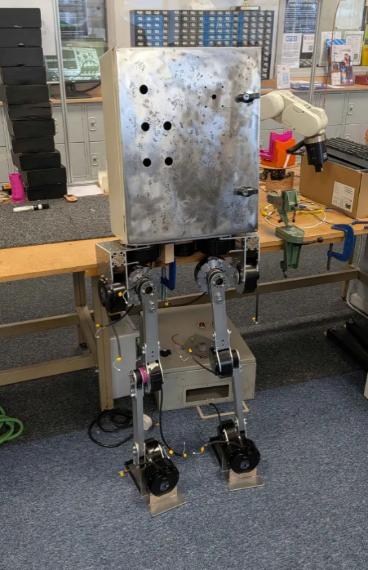{width="2.4444444444444446in" height="3.76875in"}
  ------------------------------------------------------------------------------------------- ---------------------------------------------------------------------------------
  Figure X -- Assembled aluminium legs                                                        Figure X -- Initial leg structure with demonstration box

  -----------------------------------------------------------------------------------------------------------------------------------------------------------------------------

However, this enclosure was not taken forward, as it was considered unnecessarily large relative to the requirements of the project. A more appropriately sized metal enclosure was therefore selected to house the complete electronics package, resulting in the final choice of a 400 × 300 × 200 mm full steel enclosure. Mounting holes were drilled into the base plate to accommodate installation of the box, during which it became apparent that a spacer was required to position the enclosure correctly between the two outer hip shrouding components. Therefore, a custom 3D-printed spacer was designed, manufactured and installed.

Alongside this, the remaining shrouding components were produced and mounted, with iterative fitment testing used to confirm a full range of motion remained achievable and was not significantly restricted by the surrounding panels. Once successful fitment had been confirmed and the wiring harness had been integrated, the shrouding design was finalised and the components were permanently attached. The completed mechanical structure of the Plymouth Humanoid, including all fitted shrouding components, is shown in Fig. X below.

  ------------------------------------------------------------------------------------------
  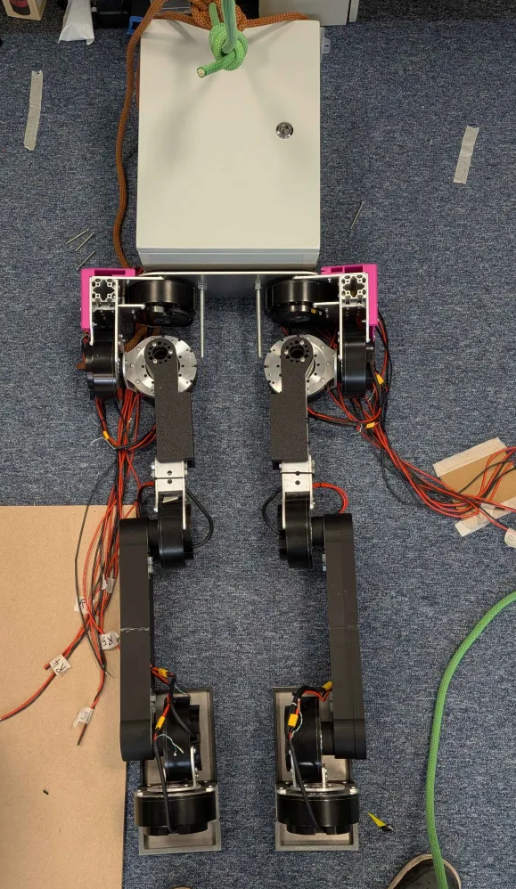{width="2.347916666666667in" height="4.047916666666667in"}
  ------------------------------------------------------------------------------------------
  Figure X -- Final Skeletal structure with all shrouding

  ------------------------------------------------------------------------------------------

## 7.7 Hardware Mounting and Miscellaneous

The mounting of the hardware within the electrical cabinet also presented a significant mechanical challenge, particularly in relation to the NVIDIA Jetson AGX Thor development board. As the Thor was primarily intended for desktop computational use, safely securing the board within a moving humanoid structure without modifying the original development hardware posed a clear integration challenge. To address this, a dedicated mounting solution was developed in Fusion 360, then tested and 3D printed in ABS before being reverse-mounted onto a backing plate for increased strength and support. This allowed the board to be installed more securely within the cabinet while maintaining compatibility with the enclosure layout. Figure X below shows the development board together with the completed mounting solution.

  -------------------------------------------------------------------------------
  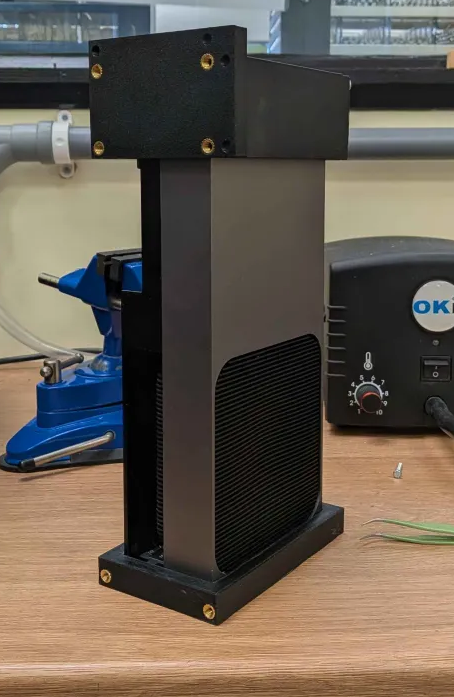{width="2.1979166666666665in" height="3.375in"}
  -------------------------------------------------------------------------------
  Figure X -- Nvidia Thor Mounting solution

  -------------------------------------------------------------------------------

With this complete, the remaining electronics were then installed alongside the additional components required for control and power connection. The custom PCBs were mounted onto an aluminium bracket that was cut, drilled and threaded to provide a secure and appropriate housing arrangement using standard PCB mounting practice. Additional components, including the contactor, fuse holder and bus bars, were also installed within the enclosure as part of the wider electrical integration. A complete view of the mounted components can be seen below in Fig. X.

  -------------------------------------------------------------------------------------------
  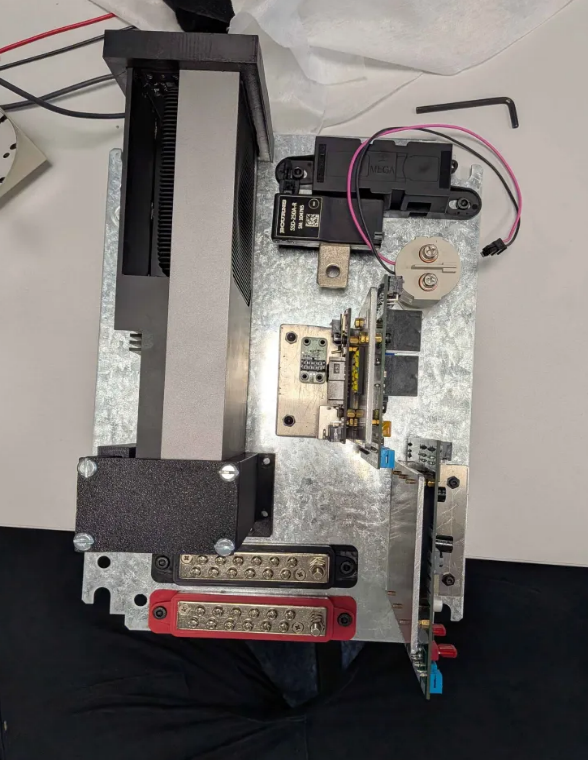{width="2.6756944444444444in" height="3.451388888888889in"}
  -------------------------------------------------------------------------------------------
  Figure X -- PCB Mounted Components

  -------------------------------------------------------------------------------------------

Additionally, for safety reasons and to reduce potential risk during testing, the robot required a secure and controlled environment in which to operate. The intended solution was to use O-ring hooks and a climbing rope arrangement attached to an external walking frame constructed from scaffolding. Although this was initially considered a relatively minor aspect of the mechanical design, it quickly developed into a more significant challenge. Figure X below shows the initial walking frame design, which, while functional, was close to being undersized and was ultimately considered not fully fit for purpose. Following the supply of longer scaffolding poles by Robotriks, a larger and more secure walking frame was constructed, allowing the robot to be safely suspended in the event of an error or during general maintenance. In addition, a pulley system was incorporated to reduce the effort required to lift a 40 kg robot at short notice and to better isolate the operator from the walking zone for improved safety. Figure Y below shows the final frame configuration with the robot suspended.

  ---------------------------------------------------------------------------------------------------------------------------------------------------------------------------------------
  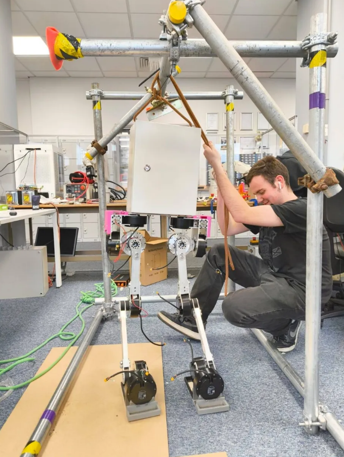{width="3.0861111111111112in" height="4.097222222222222in"}   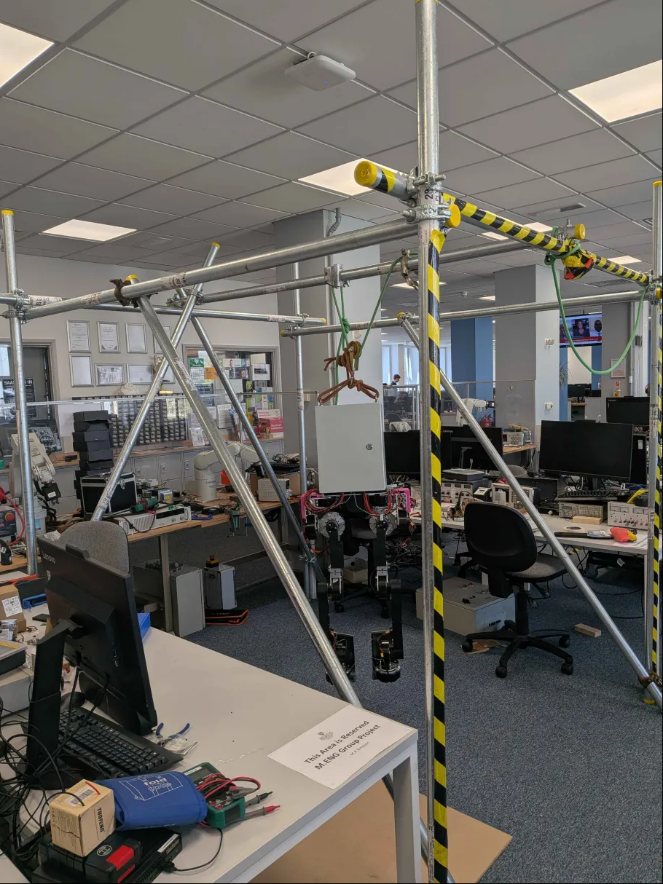{width="3.0084405074365703in" height="4.013698600174978in"}
  ------------------------------------------------------------------------------------------- -------------------------------------------------------------------------------------------
  Figure X -- Initial walking frame                                                           Figure X -- Final walking frame used

  ---------------------------------------------------------------------------------------------------------------------------------------------------------------------------------------

# 8 Electrical Design

## 8.1 Electrical Overview

## 8.2 PDU

## 8.3 PSU

## 8.4 RCU

## 8.5 Wiring Harness

## 8.6 Hardware Integration

(note i already talked about the mounting in the mechanical bit so up to you if you wanna move that bit here or not)

# 9 Reinforcement Learning Environment Design

## 9.1 RL Overview

The reinforcement learning (RL) environment was developed to generate control policies for the Plymouth Humanoid within a physics-based simulation prior to hardware deployment. It formed a central component of the control pipeline, linking the validated robot model with learning-based control methods and the sim-to-real framework.

Reinforcement learning formed the foundation of the control approach from the outset of the project, driven by the complexity of bipedal locomotion and the difficulty of deriving analytical control solutions for highly nonlinear, underactuated systems. Rather than explicitly programming behaviour, the robot is modelled as an agent that learns control strategies through interaction with its environment.

Within this framework, the agent observes its current state and outputs control actions to maximise a defined reward function. Observations were constructed from physically measurable quantities, including joint states and inertial data, while actions were defined as joint-level commands compatible with the actuator system. This established the constraints used for policy development, with deployment considerations addressed in later sections.

Policy training was implemented using Proximal Policy Optimisation (PPO), a policy-gradient-based algorithm well suited to continuous control problems. PPO updates the policy iteratively using sampled trajectories, while constraining the magnitude of each update to maintain stable learning behaviour. This allows the agent to progressively improve its control strategy over repeated simulation episodes without large destabilising changes.

The training process was structured in stages, beginning with a standing task to establish balance before progressing to more complex locomotion behaviours. Throughout this process, the observation space, action representation and control constraints were defined based on the physical system.

Overall, the RL environment acted as both a development and validation tool, enabling the progression from a verified robot model to deployable control policies within a unified framework. A diagram of the simulation development plan and training pipeline can be found in the appendices ([Appendix 4](#_Ref228444257)).

## 9.2 CAD Digital Virtual Twin

The development of the digital virtual twin began at the CAD level, where the Plymouth Humanoid model was prepared for conversion into a structured kinematic representation. Rather than directly exporting the initial design, a dedicated preparation stage was required to ensure that the model was organised, consistent and suitable for downstream use in simulation.

The original CAD assembly was refined to remove unnecessary complexity and ensure that all components were logically structured. Individual parts were grouped into clearly defined rigid bodies corresponding to the intended link structure of the robot. This organisation was essential to enable a direct mapping between CAD components and URDF links during export.

![[]{#_Toc228438581 .anchor}Figure 1 CAD Digital Virtual Twin link and joint structure.](./media/media/image18.png){width="2.5306003937007873in" height="3.7112292213473315in"}

A consistent naming convention was applied across all components to align with the joint and link definitions required for simulation and control. Each link was named to reflect its physical location within the robot, ensuring that joint ordering and articulation structure could be preserved throughout the simulation and deployment pipeline. This step was critical in avoiding ambiguity during later stages of model conversion and control implementation.

Joint definitions within Fusion 360 were also configured to reflect the intended kinematic structure of the humanoid. Each joint was assigned the correct type, axis of rotation and parent--child relationship, ensuring that the resulting kinematic chain accurately represented the physical system. Particular attention was given to joint orientation and axis alignment, as errors at this stage would directly propagate into the simulation model and affect control behaviour. Post simulation validation was carried out to ensure this was correct.

In addition to structural organisation, the physical properties of the model were reviewed to ensure consistency with the real robot. Mass properties, including link mass and centre of mass, were verified and adjusted where necessary to reflect the expected physical distribution. Models of the real motors were used to ensure weight distribution was correct, and the electrical cabinet implemented component mock-ups which had the same weight and location as the actual parts ensuring accurate representation of the system inertia and centre of mass. This ensured that the resulting digital twin would provide a realistic approximation of the robot's dynamic behaviour when used in simulation.

By establishing a clean, well-structured CAD model with consistent naming, accurate kinematics and representative physical properties, this stage provided a reliable foundation for subsequent URDF generation and simulation integration. This preparation was critical in ensuring that the exported model could be used directly within the reinforcement learning pipeline without requiring significant post-processing corrections.

## 9.3 URDF Export and USD Generation

Prior to adopting an automated export workflow, an initial attempt was made to construct the robot URDF manually. This involved extracting kinematic and dynamic properties directly from the CAD model, including link masses, centres of mass, joint transforms, and inertia tensors. A structured approach was developed to organise these parameters, ensuring consistency between joint origins, link frames, and centre of mass definitions.

Particular attention was given to the transformation of inertia tensors from CAD reference frames into link-local coordinate systems suitable for URDF representation. This required explicit handling of rotation matrices and frame alignment, as inconsistencies in these definitions would significantly affect downstream simulation behaviour. In addition, centre of mass positions were analysed across world, joint, and link frames to understand the relationships between coordinate systems within the articulated structure.

However, due to the complexity of coordinate frame definitions within the CAD environment, particularly the placement of local origins and the accumulation of transformations through the kinematic chain, the manual URDF construction process proved to be highly error-prone. Small inconsistencies in frame alignment or transformation definitions resulted in incorrect joint behaviour and unstable simulation performance. As a result, this approach was not pursued as the primary method for model generation. The derived data was retained and is presented in the appendices ([Appendix 1](#_Ref228439471)) as demonstration of the work involved in this process.

The robot model used within the simulation environment was derived from the CAD-based design and exported into a Unified Robot Description Format (URDF) representation using a Fusion360 addon named *ACDC4Robot*. This was not a turnkey process, requiring iterative refinement of the CAD structure and modification of the add-on's scripting code to achieve a valid export. While URDF provides a standardised description of kinematic and inertial properties, the raw export required further processing before it could be reliably used within NVIDIA Isaac Sim.

A pre-processing stage was introduced to address numerical inconsistencies present in the exported URDF. This was implemented using a script named clean_urdf.py. Small floating-point residuals in transformation fields (xyz and rpy) caused issues during import due to limitations associated with 32-bit floating-point precision. These values were removed using a threshold-based clean-up process, where values below 1e-12 were set to zero, ensuring compatibility with 32-bit representation and improving numerical stability during simulation import.

Following URDF sanitisation, a scripted conversion process (convert_urdf_to_usd.py) was used to generate a USD (Universal Scene Description) articulation compatible with Isaac Sim. This conversion formed the critical interface between the robot description and the simulation environment, enabling the articulated system to be instantiated and simulated under physics. The use of a scripted pipeline ensured repeatability and consistency across development iterations.

During conversion, the URDF was parsed and transformed into a USD articulation using the Isaac Lab URDF converter. Default actuator parameters, including stiffness and damping, were applied to support initial simulation stability. In parallel, joint metadata was extracted directly from the URDF, producing a configuration file containing joint ordering and limits. This ensured alignment between the simulation model, reinforcement learning environments, and deployment-side control interfaces.

Post-processing steps were required to ensure that the generated USD asset could be reliably loaded within Isaac-based workflows. This included resolving invalid sublayer references and explicitly defining a valid default prim, allowing the model to be instantiated consistently across different scripts and environments.

The resulting USD articulation provided a physics-ready representation of the robot, forming the basis for reinforcement learning environment development. Validation of articulation behaviour, joint limits, and actuator configuration was performed within the simulation environment, with detailed testing procedures and results presented in Section 11.

## 9.5 Standing RL

The development of a standing controller represented the first reinforcement learning stage in the simulation pipeline and served as the baseline for subsequent locomotion tasks. The primary objective of this stage was to train a policy capable of maintaining a stable upright posture while adhering to the constraints required for eventual sim-to-real deployment.

Unlike earlier simulation-only environments, the standing task was explicitly designed around a shared sim-to-real contract. This defined the key parameters governing training, ensuring compatibility with the deployment pipeline (see Section 9.7).

The environment operated with a fixed 12-dimensional action space and a 55-element observation vector composed of joint-level state information, inertial measurements, and control context signals derived from the hardware abstraction interface. This included:

- Joint position (relative to standing pose) ×12

- Joint velocity ×12

- Joint effort / torque ×12

- Projected gravity vector (body frame) ×3

- IMU angular velocity (gyro) ×3

- Command input ×1

- Previous action (joint position offsets) ×12

All components were derived from physically measurable quantities or control context signals consistent with the deployment interface.

A key design decision in this stage was the use of a hardware abstraction layer, allowing observations to be sourced through a consistent interface rather than directly from simulator state. This ensured alignment with the sim-to-real pipeline described in Section 9.7.

To further reduce the simulation-to-reality gap, the environment incorporated simplified models of real-world imperfections. Gaussian noise was applied to observation signals, and a one-step action delay was introduced to approximate actuator latency. These modifications increased task difficulty but encouraged the learned policy to rely on robust control strategies rather than idealised simulator feedback.

Control was implemented using a position-based formulation with fixed proportional derivative gains derived from the shared actuator configuration. The policy output was interpreted as an offset from a predefined standing posture, producing desired joint positions (q_des) which were then constrained within joint limits and packaged into control commands. This approach provided a structured control space that stabilised training while remaining compatible with deployment-side control interfaces.

The reward function was designed to encourage stable upright posture while penalising unnecessary motion and instability. This was implemented as a weighted combination of exponential reward terms and quadratic penalties applied to physically meaningful signals.

An upright reward was defined using the projected gravity vector, penalising deviation from a vertical orientation. This term was formulated as an exponential function of the tilt magnitude, strongly encouraging the robot to maintain a balanced posture. In parallel, a pose tracking reward penalised deviation from the predefined standing configuration, promoting joint configurations aligned with a stable reference pose.

To discourage unstable or excessive motion, several penalty terms were introduced. Angular velocity measured from the IMU was penalised to reduce rotational instability, while joint velocity penalties discouraged unnecessary joint movement. An additional action rate penalty was applied to limit rapid changes in control output, encouraging smoother and more physically realistic actuation behaviour.

A small constant survival reward was also included to incentivise maintaining a valid standing state over time, providing a baseline positive signal that promotes episode longevity. The final reward was constructed as a weighted sum of these components, allowing the balance between stability, posture tracking, and motion regularisation to be tuned through scaling factors.

Training was performed using a Proximal Policy Optimisation (PPO) framework integrated through Isaac Lab and the RSL-RL library. The training script ensured that the environment configuration matched the sim-to-real contract before learning began, verifying action dimensions, observation dimensions, timing parameters, and joint definitions. This prevented invalid training runs where the learned policy would not be deployable due to mismatched assumptions.

Upon completion of training, the learned policy was exported both as a standard checkpoint and as a TorchScript model suitable for deployment. The export step formed a direct bridge between training and hardware execution, enabling the policy to be loaded by the Thor-side policy runner without reliance on the training framework.

Policy behaviour was evaluated qualitatively using a dedicated playback tool, which reloaded trained checkpoints into Isaac Sim and executed them in closed-loop simulation. This allowed visual inspection of posture stability and identification of obvious failure modes prior to deployment. However, this playback process relied on the training framework rather than the deployment interface, and therefore served as a behavioural validation tool rather than a full deployment test.

Overall, the standing reinforcement learning stage established a deployable control policy while enforcing strict consistency between simulation and hardware assumptions. By adhering to the shared system definitions described in Section 9.7, this stage ensured that the resulting policy was both stable in simulation and compatible with deployment.

## 9.6 Walking Rl

The walking reinforcement learning stage extended the standing control framework toward dynamic locomotion, introducing the additional complexity of coordinated leg movement and balance during motion. While the standing task focused on stability around a fixed posture, the walking task required the policy to generate periodic stepping behaviour while maintaining overall system balance.

The action interface remained consistent with the standing environment (Section 9.5), preserving compatibility with the established control structure. However, the observation space was expanded to incorporate additional control context required for locomotion. In particular, this included the introduction of a command input, representing the desired forward velocity, and a joint position target error term, allowing the policy to reason about tracking performance relative to its commanded motion.

Reward design formed a central challenge in the walking task, requiring the combination of stability, motion generation, and gait structure within a single optimisation objective. The reward function was implemented as a weighted combination of key components targeting both locomotion performance and dynamic balance.

A primary term was the velocity tracking reward, which encouraged the robot to match a commanded forward velocity, providing the main driving signal for locomotion. This was supported by an upright reward, derived from the projected gravity vector, ensuring that forward motion was achieved without compromising overall stability.

To promote the emergence of a walking gait, contact-based rewards were introduced. A feet air-time reward encouraged lifting of the feet, while a single stance reward promoted alternating support phases between legs. These terms provided a structured signal for developing periodic stepping behaviour.

A centre of mass alignment reward was also included, encouraging the body to remain positioned over the stance foot during single support, supporting stable weight transfer. Additional shaping terms such as a forward step reward and swing clearance reward were used to encourage forward progression and reduce toe drag during swing.

Penalty terms were applied to regularise behaviour and prevent unstable solutions. In particular, a foot sliding penalty discouraged movement during ground contact, and an action rate penalty encouraged smoother control outputs.

The reward structure was highly sensitive to weighting and constraint design. It was observed that overly restrictive penalties or excessive shaping terms could prevent the policy from developing stepping behaviour, instead resulting in static or unstable solutions. This highlighted the challenge of balancing guidance and exploration within reinforcement learning for locomotion tasks.

Training was conducted using the same PPO-based framework as the standing task, allowing reuse of the established training pipeline. As such, configuration validation and export processes followed the same structure described previously.

Overall, the walking stage demonstrated the extension of the control framework to a significantly more complex task, highlighting both the potential and limitations of the approach without altering the underlying control and deployment structure.

## 9.7 Sim to Real Transfer

The final stage of the simulation pipeline focused on enabling the transfer of reinforcement learning policies from simulation to real-world execution. This required the development of a consistent interface between training environments, exported policies, and hardware-side control systems, ensuring that assumptions made during learning remained valid during deployment.

A key component of this process was the formalisation of the sim-to-real policy contract. This contract defined the shared structure governing joint ordering, joint limits, action scaling, observation layout, and control frequency. By deriving joint limits from generated URDF metadata and combining them with actuator configuration parameters, the contract ensured that all components of the system operated on a consistent representation of the robot.

The contract-driven approach allowed both training and deployment code to rely on a single source of truth for system configuration. Reinforcement learning environments validated their configuration against this contract at runtime, while deployment-side code used the same definitions to interpret policy outputs. This helped to prevent silent inconsistencies and reduce the gap between the simulation and hardware.

The previously introduced hardware abstraction layer was extended into a packet-based interface defining standardised observation and control message formats. Observations were encapsulated into structured packets containing joint position, velocity, effort, projected gravity, and IMU gyro data, while control outputs were represented as MIT-style command packets containing desired joint positions, gains, and feedforward torque. This interface enabled the same reinforcement learning environments to operate against both simulated and real data sources.

For real-world deployment, a corresponding hardware interface was developed to translate raw robot data into the same observation structure used during training. This included conversion of encoder counts into joint angles, handling of angular wrap-around, optional estimation of joint velocity, and normalisation of inertial measurements. Policy outputs were converted into structured command messages, maintaining consistent joint ordering and control parameters across the system.

The final stage of the sim-to-real pipeline was the deployment-side policy runner, designed to execute trained policies in a real-time control loop. This runner loaded a deployable policy, constructed the observation vector dynamically according to the selected sim-to-real contract, and generated joint commands at a fixed control frequency. Observations were built from structured hardware packets, combining joint states, inertial measurements, command inputs, and previous actions into a contract-compliant vector.

Policy outputs were interpreted as bounded joint-space actions, scaled and offset relative to a predefined standing configuration to produce desired joint positions (q_des). These were clamped within joint limits and combined with fixed proportional-derivative gains to generate MIT-style control commands. Runtime checks ensured that observation and action dimensions matched the contract definition and that no invalid numerical values were present before commands were transmitted.

The deployment-side policy runner also provided defined insertion points for integration with the ROS-based control system through two interface functions: a state reader and a command writer. These functions acted as placeholders within the architecture, defining where robot state data would be acquired and where control commands would be transmitted. The implementation of these functions was left to the software subsystem, allowing the ROS communication layer to be developed independently while maintaining a clear and consistent interface for policy input and output.

The runner operated within a deterministic timing loop, maintaining a fixed execution frequency while compensating for timing drift. It also maintained internal control state, including previous actions and commanded motion inputs, allowing runtime switching between standing and walking modes. A safe fallback mechanism ensured that the robot returned to a stable standing pose upon termination.

The sim-to-real architecture also incorporated several mechanisms to improve robustness. Observation noise was introduced during training to reduce reliance on idealised simulator data, and simple latency models were applied through action delay. These measures aimed to reduce the discrepancy between simulated and real sensor signals, improving the likelihood of successful transfer.

# 10 Software Stack

## 10.1 Software Overview

This diagram needs updating

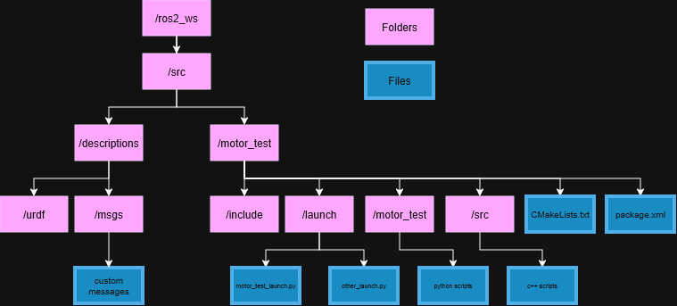{width="6.260416666666667in" height="2.8333333333333335in"}Used Software:

ROS2 Jazzy

VS CODE

GitHub Copilot for bug fixing

Libraries:

## 10.2 ROS initial implementation

ROS2 Jazzy -- a newer ROS distribution that supports the Ubuntu dist on the thor

## 10.3 Initial Motor Command Interaction

Testing with nucleo board and sending direct serial commands

Scale up to two motors, control each motor independantly.

Motor control integrated with custom PCB and ethernet connection instead of serial

Test with thor

### 10.3.1 Can Bridge

Ros to can

## 10.4 Scale up to multiple motors

Set can_ids to be unique using the motor tool

## 10.5 System Integration 

# 11 System Integration and Testing

## 11.1 Initial Motor Testing

Initial motor testing focused on three key areas: regenerative voltage behaviour, communication with the motors over the CAN bus network, and actuator positional accuracy under commanded movement. These tests were carried out to validate the practical behaviour of the RobStride 04 motors used before wider electrical and control integration.

Tests were first conducted to determine whether a functional requirement existed for a braking chopper regeneration dissipation device. A mass was suspended at a fixed distance from the motor output. The motor was then raised to its maximum position and allowed to fall to its minimum position, corresponding to 180 degrees of rotation. This test was repeated in 1 kg mass increments, with the resulting peak bus voltage recorded using an oscilloscope. The supply bus was maintained at 32 V and 10 A in order to represent a low powered motor bus, to give the maximum amount of possible voltage fluctuation capable before entering a motor fault state due to bus overvoltage. Results showed that at a peak load of 6.6 kg, the bus voltage could rise to 116 V. This posed a significant risk to the power supply if reflected back across multiple motors and was also more than likely to trigger high-bus-voltage faults within the RobStride actuators. As these faults power latch and can subsequently only be cleared by power-cycling the motors, the test confirmed the need for a braking chopper to protect both the power system and the actuators. Full documentation of this test is provided in Appendix X under "Initial Motor Regeneration Testing".

In parallel with this, motor communication was tested across two different control devices. Initial testing was carried out using the official RobStride motor tool, which was used primarily to zero the motors and confirm basic communication. To improve understanding of the command structure and provide a more flexible test environment, a dedicated motor GUI was then developed to communicate directly with the motor under test. This GUI allowed more convenient position command entry, on-the-fly zeroing and a clearer validation of motor response. To assess positional accuracy, a reference mark was applied between the rotating inner ring of the motor and the outer static casing. The motor was then zeroed, and known angular commands of 90, 180, and 360 degrees were sent. The resulting angular displacement was compared against the expected position using the marks and a protractor. These tests confirmed that the CAN command packets were being interpreted correctly and that the motors were responding as intended. The same GUI-based communication process was later extended to include an STM32 Nucleo board transmitting the CAN messages, simulating the intended RCU bus connection and providing an early proof of concept for the STM-based control architecture used within the wider electrical subsystem. This further validated both the CAN messaging structure and the feasibility of the proposed RCU-to-motor interface. Both the Motor Gui test code and the Nucelo board test code can be found appendix (NUMBER).

## 11.2 Breaking Chopper Testing 

Following construction of the braking chopper, testing was conducted to validate its ability to mitigate regenerative bus voltage fluctuations within the motor system which where proven to cause issues through the initial testing conducted. The same experimental setup was used as in the inital testing, with a minor change of a mass know to cause regen issues attached to the motor output and allowed to move from the uppermost position to the lowest position before being returned to the starting position. The DC bus voltage was monitored using an oscilloscope, which showed clear evidence of the braking chopper activating and limiting the bus voltage to 55 V. This remained within the 60 V operating limit of the RobStride 04 actuators. When the same test was conducted without the braking chopper connected, the motor immediately entered a fault state after the mass was released, indicating that the bus voltage had exceeded the maximum allowable value. This confirmed that the braking chopper operated as intended and was effective in preventing the bus voltage from rising to potentially damaging levels for both the power supply unit and the motors connected to the bus. Further information is provided in Appendix X under "Braking Chopper Function Testing".

## 11.3 Power on Testing 

## 11.4 Simulation System Integration and Testing

The simulation and deployment pipeline was validated through a staged integration and testing process, ensuring that each component operated correctly before full system integration. Testing was structured across simulation-level validation, reinforcement learning system verification, and sim-to-real deployment testing, reflecting the progression of the development pipeline.

Initial testing focused on validating the correctness of the robot model within the simulation environment following USD generation and integration. The generated USD asset was first verified through direct instantiation using a standalone spawn script, confirming that the model could be correctly parsed and simulated within NVIDIA Isaac Sim.

Joint-axis validation was performed by actuating individual joints under zero-gravity conditions, allowing visual confirmation of axis orientation and motion direction. This verified that joint definitions from the URDF were preserved correctly during conversion. The script which automated this process is named: 'joint_axis_validation.py'.

A Joint-limit validation script named: 'joint_limit_validation.py' provided quantitative verification of articulation behaviour. Each joint was commanded to its defined bounds, and the resulting positions were recorded. Results demonstrated high-fidelity tracking of joint limits within a negligible tolerance, confirming that the model constraints and actuator configuration were consistent with the intended physical system. The results of this test can be found in the appendices ([Appendix 2](#_Ref228440800)).

A torque saturation validation stage named: 'joint_torque_saturation_validation.py' was used to evaluate actuator behaviour under high load conditions and establish the actuator configuration used within the reinforcement learning environments. This ensured that joint commands produced during training remained within physically achievable limits. The outcome of this was the production of the 'walking_actuator_config.py' which would be referenced in the training environment during reinforcement learning training. A link to the results of the test can be found in the appendices ([Appendix 3](#_Ref228442559)).

Finally, a standing configuration validation was performed to confirm that the robot could achieve and maintain a stable upright posture. This was named 'standing_configuration.py'. This ensured that initial conditions used during reinforcement learning were physically meaningful and aligned with the robot's kinematic structure. This was then used as the reset position within the training.

## 

## 11.5 Reinforcement Learning System Testing

IMAGE OF THE VALIDATION PIPELINE

Following simulation-level validation, testing was extended to the reinforcement learning system to verify correct interaction between environment definitions, training processes, and policy outputs.

Training scripts were executed to perform full reinforcement learning runs, producing both intermediate checkpoints and deployment-ready policy exports. Prior to training, environment configurations were verified to ensure consistency in action dimensions, observation structure, joint ordering, and control frequency.

Post-training validation was performed using playback tools, where trained policies were reloaded into the simulation environment and executed in closed-loop control. This enabled qualitative assessment of policy behaviour, including posture stability and response to perturbations, without requiring retraining.

Using this data, AI tools were used to help review and adjust the reward scaling\'s to enable fast iteration and converging of walking gait behaviour. This presented it's own challenges where you were relying on AI image recognition of screenshots uploaded, and interpretation of text description of the training output to aid with the next parameter adjustment.

These tests confirmed that the reinforcement learning pipeline operated as expected, producing valid policies consistent with the defined system configuration.

## 11.6 Sim-to-Real Integration Testing

The final stage of testing focused on validation of the sim-to-real deployment pipeline, ensuring that trained policies could operate correctly outside the simulation environment.

A dedicated testbench was developed for the deployment-side policy runner, allowing the full observation and control pipeline to be exercised without requiring live hardware. This enabled controlled validation of observation construction, policy inference, and command generation.

Test cases included nominal upright conditions, roll and pitch perturbations, angular velocity inputs, and joint-offset scenarios. These inputs were used to verify that the observation vector was constructed correctly and that the policy responded appropriately to changes in system state.

Results confirmed that the policy runner produced valid 12-dimensional control outputs consistent with the defined action space. Joint ordering was verified to match the expected articulation structure, ensuring consistency between simulation and deployment representations.

Under perturbed conditions, the policy generated distinct control responses corresponding to variations in projected gravity and angular velocity inputs, demonstrating correct integration of inertial observations. Generated joint commands remained bounded within expected limits, indicating stable and physically plausible outputs.

In addition, TorchScript policy export was validated as part of the deployment pipeline, confirming that trained policies could be executed independently of the training framework within a real-time control loop.

These results demonstrate that the observation pipeline, policy inference, and control output generation operate correctly outside the simulation environment, providing evidence of successful sim-to-real integration at the software level.

## 11.7 Walking Accuracy Testing 

# 12 Results and Critical Evaluation

## 12.1 System Performance evaluation 

## 12.2 Comparison to Specification 

## 

# 13 Conclusion and Future Improvements

## 13.1 Conclusion

## 13.2 Future Improvements

# 14 Figures

[Figure 1 CAD Digital Virtual Twin link and joint structure. [34](#_Toc228438581)](#_Toc228438581)

# 15 Appendices

[IP Landscape Report Proj 500 Humanoid](https://liveplymouthac-my.sharepoint.com/:b:/g/personal/brendan_taylor_students_plymouth_ac_uk/IQDtOcsJr9WlRrOr62q75QTxAUCEWhye9KizeMFJ2oZi-UQ?e=aIrGBt)

[Inital Shrouding.pdf](https://liveplymouthac-my.sharepoint.com/:b:/g/personal/brendan_taylor_students_plymouth_ac_uk/IQD8K7UmR-roS6v0dHQMyBPGAWmaJgb_ZLKrOUNTdUzf570?e=fSeTl3)

[Initial Motor Regen testing.docx](https://liveplymouthac.sharepoint.com/:w:/s/PROJ500/IQB8DWOIoC7VR4--0VQQ8vnmAWjhzNuo6_mU-cAZWyPEnmc?e=Cm3swu)

[Breaking Chopper function testing.docx](https://liveplymouthac.sharepoint.com/:w:/s/PROJ500/IQByZzMLeB11TZs3CCdU5wYOATas7LY6IJN82gcJIbHXkfg?e=MgW1OM)

[Motor_gui_and_Nucleo.zip](https://liveplymouthac-my.sharepoint.com/:u:/g/personal/brendan_taylor_students_plymouth_ac_uk/IQDhnU2es_0qSb1DgtWlOnQ4AaufJ1jch6jJR_ym7LBWVlk?e=F94eGv)

[]{#_Ref228439471 .anchor}Appendix Excel document showing manual configuration process of URDF

[USD_manual.xlsx](https://liveplymouthac.sharepoint.com/:x:/r/sites/PROJ500/Shared%20Documents/Resources/Simulation/USD_manual.xlsx?d=w1a7eba7e124c4473b4476926fb22108e&csf=1&web=1&e=DMQ6gf)

[]{#_Ref228440800 .anchor}Appendix Joint Limit Results from joint_limit_validation.py script

[joint_limit_results.csv](https://liveplymouthac-my.sharepoint.com/:x:/r/personal/joseph_andrews_students_plymouth_ac_uk/Documents/Uni%20Documents/Year%205/PROJ500/Final%20Report/joint_limit_results.csv?d=w444ce7d85b00423098da6d7f94a52b6d&csf=1&web=1&e=DHkhu0)

[]{#_Ref228442559 .anchor}Appendix Joint Torque Saturation Results

[joint_torque_saturation_results.csv](https://liveplymouthac-my.sharepoint.com/:x:/r/personal/joseph_andrews_students_plymouth_ac_uk/Documents/Uni%20Documents/Year%205/PROJ500/Final%20Report/joint_torque_saturation_results.csv?d=w96db8799c184488e9f88dff828012745&csf=1&web=1&e=WhdQzw)

![[]{#_Ref228444257 .anchor}Appendix Simulation Development Overview](./media/media/image20.png){width="6.062579833770779in" height="4.472247375328084in"}

# 16 References

1 -- Unitree G1

Unitree.com. (2016). *Humanoid robot G1_Humanoid Robot Functions Humanoid Robot Price \| Unitree Robotics*. \[online\] Available at: <https://www.unitree.com/g1>.

(Unitree.com, 2016)

2- Figure AI

FigureAI. (n.d.). *Figure*. \[online\] Available at: <https://www.figure.ai/>.

(FigureAI, n.d.)

3 -- Figure AI joint pattent

Google.com. (2025). *WO2025213141A1 - Hip assembly and kinematics of a humanoid robot - Google Patents*. \[online\] Available at: https://patents.google.com/patent/WO2025213141A1/en \[Accessed 27 Apr. 2026\].

(Google.com, 2025)

4\. KAIST Humanoid v0.7 video

KAIST DRCD Lab (2026). *KAIST Humanoid v0.7: Field Test and Interaction Demo*. \[online\] YouTube. Available at: https://www.youtube.com/watch?v=9qZcTMARvpk \[Accessed 27 Apr. 2026\].

(KAIST DRCD Lab, 2026)

5 -- lab regen testing documentation

Sharepoint.com. (2026). *Redirecting*. \[online\] Available at: https://liveplymouthac.sharepoint.com/:w:/r/sites/PROJ500/\_layouts/15/Doc2.aspx?action=edit&sourcedoc=%7B88630d7c-2ea0-47d5-8fbe-d15410f2f9e6%7D&wdExp=TEAMS-TREATMENT&web=1 \[Accessed 27 Apr. 2026\].

‌(Sharepoint.com, 2026)

# References

Nvidia, 2026. *Sim-to-Real Policy Transfer.* \[Online\]\
Available at: [https://isaac-sim.github.io/IsaacLab/main/source/experimental-features/newton-physics-integration/sim-to-real.html]{.underline}\
\[Accessed 2026\].

Open Robotics, 2026. *Generating an URDF File.* \[Online\]\
Available at: [https://docs.ros.org/en/humble/Tutorials/Intermediate/URDF/Exporting-an-URDF-File.html]{.underline}

Project, B.-R., 2026. *BDX-R-IsaacLab.* \[Online\]\
Available at: [https://github.com/BDX-R/BDX-R-IsaacLab?tab=readme-ov-file#readme]{.underline}\
\[Accessed 2026\].
